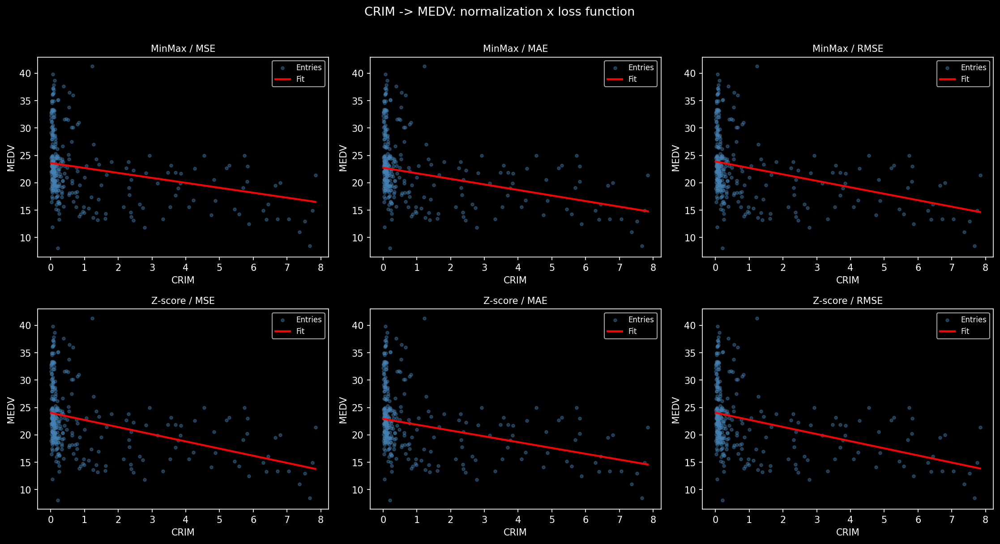

# Day 01 - Linear Regression from Scratch

An implementation of univariate linear regression trained with gradient descent, built as a learning exercise. No ML frameworks are used for the model itself. The project explores how the choice of normalization and loss function affects training and final model quality. As well as implementing gradient descent manually.

## Dataset

The [Boston Housing dataset](https://www.cs.toronto.edu/~delve/data/boston/bostonDetail.html) is used. The task is to predict median home value (MEDV) from per-capita crime rate (CRIM).

The dataset is split 80/20 into train and test sets. IQR-based outlier removal is applied to CRIM and MEDV in the training set only, reducing the training set from 404 to 319 samples.

## Implementation

All components are implemented from scratch in Python using only NumPy and Pandas.

**Normalizers**
- `MinMaxNormalizer` scales features to [0, 1]
- `ZScoreNormalizer` standardizes to zero mean and unit variance

**Loss functions** 
- `MSELoss` mean squared error
- `MAELoss` mean absolute error
- `RMSELoss` root mean squared error

## Training
Gradient descent runs until convergence or a hard cap of 10000 epochs, detected by watching for fewer than `tol=1e-6` improvement over `patience=10` consecutive epochs at `lr=0.01`.

## Results

All six normalization / loss combinations were trained and evaluated on the held-out test set:

| Norm    | Loss | MSE     | MAE    | RMSE   | Converged at epoch |
|---------|------|---------|--------|--------|--------------------|
| MinMax  | MSE  | 69.6253 | 5.3421 | 8.3442 | 2385               |
| MinMax  | MAE  | 79.7235 | 5.5348 | 8.9288 | 1824               |
| MinMax  | RMSE | 88.0801 | 5.8713 | 9.3851 | 835                |
| Z-score | MSE  | 99.8441 | 6.1996 | 9.9922 | 289                |
| Z-score | MAE  | 82.5599 | 5.6308 | 9.0862 | 378                |
| Z-score | RMSE | 99.0840 | 6.1809 | 9.9541 | 491                |

MinMax + MSE achieves the best test error on all three metrics. Z-score normalizations converge much faster but produce weaker fits, likely because the z-score transformation compresses the feature distribution in a way that makes gradient descent overshoot the optimum early.

The fits are weak overall (test RMSE of ~8-10 on home values), which is expected — CRIM has a non-linear, heavily skewed relationship with MEDV that a single-feature linear model cannot capture well.



## Usage

From the `01-linear-regression-predict-ho` directory:

```bash
uv sync
```
then run the notebook

The script expects the dataset at `data/housing.csv` with no header row and whitespace-delimited columns in the standard Boston Housing column order.