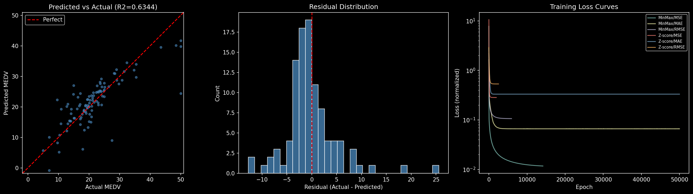

# Day 02 - Multivariable Linear Regression

An extension of the Day 1 implementation to multivariable linear regression on the full Boston Housing dataset. All 13 features are used to predict median home value (MEDV). No ML frameworks are used for the model itself — only NumPy, Pandas, and sklearn's `train_test_split`.
Structure of the code was also improved to make it more managable.
## Dataset

The [Boston Housing dataset](https://www.cs.toronto.edu/~delve/data/boston/bostonDetail.html). The task is to predict median home value (MEDV) from all 13 features.

The dataset is split 80/20 into train and test sets. Two training configurations were compared: with and without IQR-based outlier removal (k=3.0) applied to all continuous features and the target in the training set only. The variance of each feature is checked after filtering and any zero-variance features are dropped before training.

## Implementation

All components are implemented from scratch using only NumPy and Pandas.

**Normalizers**
- `MinMaxNormalizer` scales features to [0, 1]
- `ZScoreNormalizer` standardizes to zero mean and unit variance

**Loss functions**
- `MSELoss` mean squared error
- `MAELoss` mean absolute error
- `RMSELoss` root mean squared error

**Evaluation metrics**
- MSE, MAE, RMSE, R², MAPE, MaxError

## Training

Gradient descent with `lr=0.01`, convergence detected by fewer than `tol=1e-7` improvement over `patience=20` consecutive epochs, hard cap at 50000 epochs. All six normalization / loss combinations are trained and evaluated.

## Results

Outlier removal made the best result worse:

Outlier Removed Best model: MinMax + RMSE (R2 = 0.6360)
With Outliers Best model: Z-score + MSE (R2 = 0.6676)

### Best model: Z-score + MSE without outlier removal (R² = 0.6676)

## Usage

From the project directory:

```bash
uv sync
```

Then run the notebook.